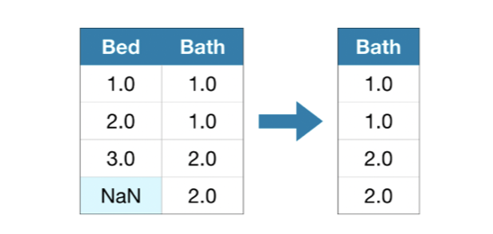
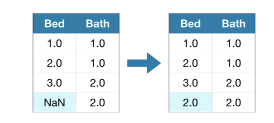
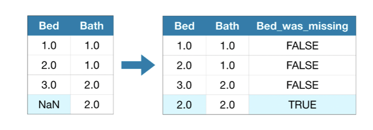
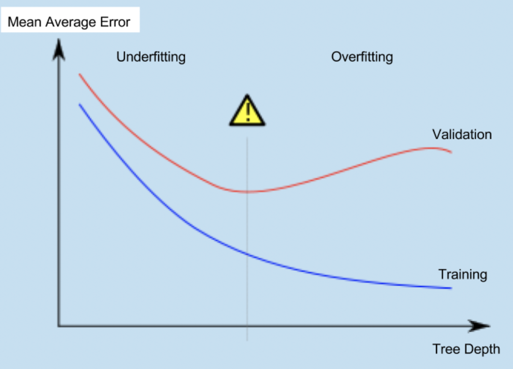

# ML Compendium


This is a compendium of all my learning from Kaggle distilled into one page. Please don't use this as a ref only and not a primary learning source, please go direct to kaggle.com at the learn section if you wish to gain the full learning experience.  


[1] - [Terminology](#Terminology)  
[2] - [High level steps](#STEPS)  
[3] - [EXAMPLES](#EXAMPLES)  
[4] - [MEAN ABSOLUTE ERROR](#MEAN-ABSOLUTE-ERROR)  
[5] - [FULL CODE SAMPLE ](#FULL-CODE-SAMPLE)  
[6] - [DECISION TREE](#DECISION-TREE)  
[7] - [RANDOM FORREST](#RANDOM-FORREST)  

# STEPS 
The steps to building and using a model are:

**Define:** What type of model will it be? A decision tree? Some other type of model? Some other parameters of the model type are specified too.  
**Fit:** Capture patterns from provided data. This is the heart of modeling.  
**Predict:** Just what it sounds like  
**Evaluate:** Determine how accurate the model's predictions are.

# EXAMPLES

## SIMPLE FITTING 

```python

from sklearn.tree import DecisionTreeRegressor

# Define model. Specify a number for random_state to ensure same results each run
MYMODEL = DecisionTreeRegressor(random_state=1)

# Fit model
MYMODEL.fit(X, y)
```

## MEAN ABSOLUTE ERROR 
  
Information on MAE can be found in the terminology section at the bottom.  
```python
from sklearn.metrics import mean_absolute_error

predicted_home_prices = melbourne_model.predict(X)

mean_absolute_error(y, predicted_home_prices) 

```  
  
## SPLITTING DATA 

```python

from sklearn.model_selection import train_test_split

# split data into training and validation data, for both features and target
# The split is based on a random number generator. Supplying a numeric value to
# the random_state argument guarantees we get the same split every time we
# run this script.
# SPLIT DATA 

train_X, val_X, train_y, val_y = train_test_split(X, y, random_state = 0)

#-----------------------------------------------  Define model
melbourne_model = DecisionTreeRegressor()

#----------------------------------------------- Fit model
melbourne_model.fit(train_X, train_y)

#-----------------------------------------------  get predictions on VALIDATION data 
val_predictions = melbourne_model.predict(val_X)
print(mean_absolute_error(val_y, val_predictions))

```

# FULL CODE SAMPLE 
## DecisionTreeRegressor

```python
import pandas as pd

# Path of the file to read
iowa_file_path = '../input/home-data-for-ml-course/train.csv'
home_data = pd.read_csv(iowa_file_path)

# PRINT COLUMNS
home_data.columns

# TARGET
y = home_data.SalePrice

# SLICE TO COLUMNS
feature_names = ['LotArea','YearBuilt','1stFlrSF','2ndFlrSF','FullBath','BedroomAbvGr']

# SELECT COLUMNS FEATURES
X = home_data[feature_names]

# FIT MODEL
from sklearn.tree import DecisionTreeRegressor

model = DecisionTreeRegressor(random_state=1)
model.fit(X,y)

# PREDICT

prediction = model.predict(X)
```

# DECISION TREE  

- LOTS OF OPTIONS 
- LEAF = ONE UNIT
- DEPTH = SPLIT

Depth of 10 means 2^10 (1024) leaves. 
  
- max_leaf_nodes helps us limmit overfitting 
  
## Important     
### MAE UTILITY FUNCTION 

We can use a utility function to help compare **MAE scores** from different values for max_leaf_nodes:   

```python
from sklearn.metrics import mean_absolute_error
from sklearn.tree import DecisionTreeRegressor

def get_mae(max_leaf_nodes, train_X, val_X, train_y, val_y):
    model = DecisionTreeRegressor(max_leaf_nodes=max_leaf_nodes, random_state=0)
    model.fit(train_X, train_y)
    preds_val = model.predict(val_X)
    mae = mean_absolute_error(val_y, preds_val)
    return(mae)


# compare MAE with differing values of max_leaf_nodes	

for max_leaf_nodes in [5, 50, 500, 5000]:
    my_mae = get_mae(max_leaf_nodes, train_X, val_X, train_y, val_y)
    print("Max leaf nodes: %d  \t\t Mean Absolute Error:  %d" %(max_leaf_nodes, my_mae))
    
```
  
    
```shell
Max leaf nodes: 5  		 Mean Absolute Error:  347380
Max leaf nodes: 50  		 Mean Absolute Error:  258171
Max leaf nodes: 500  		 Mean Absolute Error:  243495
Max leaf nodes: 5000  	 Mean Absolute Error:  254983
```
  
    
```python 
# OBTAIN BEST HYPER PARAMETER USING LAMBDA AND DICT 
scores = {leaf_size: get_mae(leaf_size, train_X, val_X, train_y, val_y) for leaf_size in candidate_max_leaf_nodes}
best_tree_size = min(scores, key=scores.get)
```

## FULL DECISION TREE CODE 

```python
import pandas as pd
from sklearn.tree import DecisionTreeRegressor
from sklearn.model_selection import train_test_split
from sklearn.metrics import mean_absolute_error 

#PREP
iowa_file_path = 'train.csv'
home_data = pd.read_csv(iowa_file_path)
home_data.columns
y = home_data.SalePrice
feature_names = ['LotArea','YearBuilt','1stFlrSF','2ndFlrSF','FullBath','BedroomAbvGr']
X = home_data[feature_names]
train_X, val_X, train_y, val_y = train_test_split(X, y, random_state=1)

# OPTIMISE
def get_mae(max_leaf_nodes, train_X, val_X, train_y, val_y):
    model = DecisionTreeRegressor(max_leaf_nodes=max_leaf_nodes, random_state=0)
    model.fit(train_X, train_y)
    preds_val = model.predict(val_X)
    mae = mean_absolute_error(val_y, preds_val)
    return(mae)

# ITERATE
candidate_max_leaf_nodes = [5, 25, 50, 100, 250, 500]
leaf_dict = {}
for leaf_size in candidate_max_leaf_nodes:
    current_min = get_mae(leaf_size, train_X, val_X, train_y, val_y)
    leaf_dict[leaf_size] = current_min

best_tree_size = min(leaf_dict, key=leaf_dict.get) 

# Final result using `best_tree_size`. 

final_model = DecisionTreeRegressor(max_leaf_nodes=best_tree_size, random_state=1)
final_model.fit(X, y) # FIT ON ALL DATA, NOT JUST TRAIN
prediction = final_model.predict(val_X)
val_mae = mean_absolute_error(val_y, prediction)

```


# Random Forrest  

- MUCH BETTER THAN DECISION TREE
- EVEN WITHOUT TUNING IT'S GOOD 

## EXAMPLE 
  
```python
from sklearn.ensemble import RandomForestRegressor
from sklearn.metrics import mean_absolute_error

forest_model = RandomForestRegressor(random_state=1)
forest_model.fit(train_X, train_y)
melb_preds = forest_model.predict(val_X)
print(mean_absolute_error(val_y, melb_preds))
```


## Full Code with Optimiser  

```python 

# Code you have previously used to load data
import pandas as pd
# FIT MODEL
#from sklearn.tree import DecisionTreeRegressor NOT NEEDED NOW
from sklearn.ensemble import RandomForestRegressor
# Import the train_test_split function and uncomment
from sklearn.model_selection import train_test_split
from sklearn.metrics import mean_absolute_error

#------------------------------------------------------------------------------------------
# STANDARD PREP APPROACH
#------------------------------------------------------------------------------------------

# Path of the file to read
iowa_file_path = 'train.csv'
home_data = pd.read_csv(iowa_file_path)
# print the list of columns (to find the target we want to predict) 
home_data.columns
# set target output
y = home_data.SalePrice
# SLICE THE HOME DATA INTO TARGETTED COLUMNS ONLY
features = ['LotArea','YearBuilt','1stFlrSF','2ndFlrSF','FullBath','BedroomAbvGr']
# select data corresponding to features in features
X = home_data[features]
# Split into validation and training data
train_X, val_X, train_y, val_y = train_test_split(X, y, random_state=1)


#------------------------------------------------------------------------------------------
# OPTIMISER
#------------------------------------------------------------------------------------------

model_1 = RandomForestRegressor(n_estimators = 50, random_state = 0)
model_2 = RandomForestRegressor(n_estimators = 100, random_state = 0)
model_3 = RandomForestRegressor(n_estimators = 100, random_state = 0, criterion = 'mae')
model_4 = RandomForestRegressor(n_estimators = 200, random_state = 0, min_samples_split = 20)
model_5 = RandomForestRegressor(n_estimators = 100, random_state = 0, max_depth = 7)
model_6 = RandomForestRegressor(n_estimators = 100, random_state = 1)


models = [model_1,model_2,model_3,model_4,model_5,model_6]

# COMPARE DIFFERENT MODELS FUNCTION

def score_model(model, X_t = train_X, X_v = val_X, y_t = train_y, y_v= val_y):
    model.fit(X_t, y_t)
    preds = model.predict(X_v)
    return mean_absolute_error(y_v, preds)  


mae = 999999 # make it high 
mae_index = 0

for i in range(0, len(models)):
	mae_current = score_model(models[i])
	if mae_current < mae:
		mae = mae_current
		mae_index = i
	print("Model %d MAE: %d" % (i+1, mae_current))

print("Min MAE value is : " + str(mae) + ' and the model index is ' + str(mae_index))
#------------------------------------------------------------------------------------------
# BUILD  MODEL
#------------------------------------------------------------------------------------------

model = models[mae_index]
model.fit(train_X, train_y)

prediction = model.predict(val_X)
MAE = mean_absolute_error(prediction, val_y)


#------------------------------------------------------------------------------------------
# PRINT 
#------------------------------------------------------------------------------------------

print("Validation MAE for Random Forest Model: {}".format(MAE))


```

# Managing Missing Values  

## Three Approaches   
  
### DROP COLUMN 
  


  
**Easiest appraoch** only do this if most values are missing from column or you lose valuable data.  

## Imputation  

. 
  
**BETTER OPTION**  This fills in the missing value with a number (like the mean/average). 
  
## Advanced Imputation 
  
  
  
There may be a hidden pattern in the data that's missing *(maybe they are all above a certain threshold)* By adding a flag to notify which values were missing allows for better compute.  


# Terminology 

## Mean Absolute Error (MAE)
MAE measures the average magnitude of the errors in a set of predictions, without considering their **direction**

## Root mean squared error (RMSE)
RMSE is a quadratic scoring rule that also measures the average magnitude of the error. It’s the square root of the average of squared differences between prediction and actual observation

## Overfitting

- ACCURATE FOR EXISTING DATA
- POOR FOR NEW DATA

## Underfitting

- FAILS TO GENERALIZE FOR EXISTING DATA SET    

  
  
  
  
  
  
The middle (warning sign) is optimal location) 


