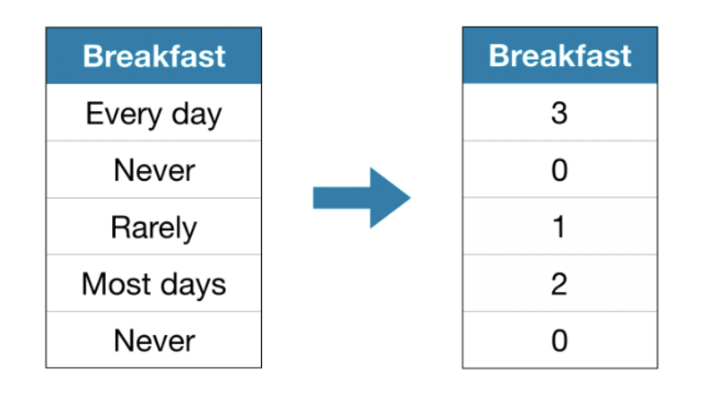
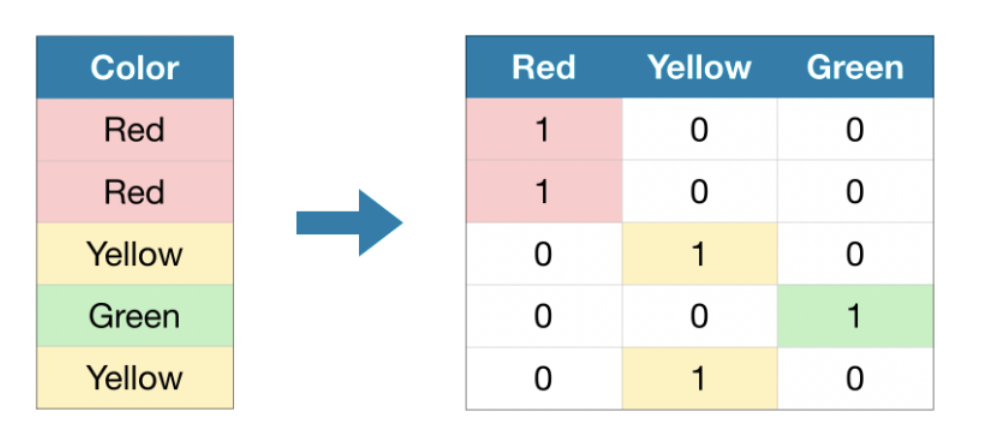

# ML Compendium


This is a compendium of all my learning from Kaggle distilled into one page. Please don't use this as a ref only and not a primary learning source, please go direct to kaggle.com at the learn section if you wish to gain the full learning experience.  


# CONTENTS  
  
  
## Basics 
[1] - [Terminology](#Terminology)  
[2] - [High level steps](#STEPS)  
[3] - [Mean Absolute Error](#MEAN-ABSOLUTE-ERROR)  
[4] - [Examples](#EXAMPLES)  
[5] - [Full Code Sample](#FULL-CODE-SAMPLE) 

## Techniques  
[1] - [Work out data types](#Get-list-of-categorical-variables)  
[2] - [Managing Missing Values](#Managing-Missing-Values)  
[3] - [Managing Catagorical Variables](#CATAGORICAL-VARIABLES)  
[4] - [Onehot Encoding](#One-Hot-Encoding)  
[5] - [Catagorical Processing code](#Catagorical-Processing-Functions)

## Model Types 
  
[1] - [Decision tree](#DECISION-TREE)  
[2] - [Random Forrest](#RANDOM-FORREST)  


# STEPS 
The steps to building and using a model are:

**Define:** What type of model will it be? A decision tree? Some other type of model? Some other parameters of the model type are specified too.  
**Fit:** Capture patterns from provided data. This is the heart of modeling.  
**Predict:** Just what it sounds like  
**Evaluate:** Determine how accurate the model's predictions are.

# EXAMPLES
#### [main Menu](#CONTENTS)    

## SIMPLE FITTING 

```python

from sklearn.tree import DecisionTreeRegressor

# Define model. Specify a number for random_state to ensure same results each run
MYMODEL = DecisionTreeRegressor(random_state=1)

# Fit model
MYMODEL.fit(X, y)
```

## MEAN ABSOLUTE ERROR 
  
Information on MAE can be found in the terminology section at the bottom.  
```python
from sklearn.metrics import mean_absolute_error

predicted_home_prices = melbourne_model.predict(X)

mean_absolute_error(y, predicted_home_prices) 

```  
  
## SPLITTING DATA 

```python

from sklearn.model_selection import train_test_split

# split data into training and validation data, for both features and target
# The split is based on a random number generator. Supplying a numeric value to
# the random_state argument guarantees we get the same split every time we
# run this script.
# SPLIT DATA 

train_X, val_X, train_y, val_y = train_test_split(X, y, random_state = 0)

#-----------------------------------------------  Define model
melbourne_model = DecisionTreeRegressor()

#----------------------------------------------- Fit model
melbourne_model.fit(train_X, train_y)

#-----------------------------------------------  get predictions on VALIDATION data 
val_predictions = melbourne_model.predict(val_X)
print(mean_absolute_error(val_y, val_predictions))

```

# FULL CODE SAMPLE 
## DecisionTreeRegressor

```python
import pandas as pd

# Path of the file to read
iowa_file_path = '../input/home-data-for-ml-course/train.csv'
home_data = pd.read_csv(iowa_file_path)

# PRINT COLUMNS
home_data.columns

# TARGET
y = home_data.SalePrice

# SLICE TO COLUMNS
feature_names = ['LotArea','YearBuilt','1stFlrSF','2ndFlrSF','FullBath','BedroomAbvGr']

# SELECT COLUMNS FEATURES
X = home_data[feature_names]

# FIT MODEL
from sklearn.tree import DecisionTreeRegressor

model = DecisionTreeRegressor(random_state=1)
model.fit(X,y)

# PREDICT

prediction = model.predict(X)
```

# DECISION TREE   
#### [main Menu](#CONTENTS)
  
    
- LOTS OF OPTIONS 
- LEAF = ONE UNIT
- DEPTH = SPLIT

Depth of 10 means 2^10 (1024) leaves. 
  
- max_leaf_nodes helps us limmit overfitting 
  
## Important     
### MAE UTILITY FUNCTION 

We can use a utility function to help compare **MAE scores** from different values for max_leaf_nodes:   

```python
from sklearn.metrics import mean_absolute_error
from sklearn.tree import DecisionTreeRegressor

def get_mae(max_leaf_nodes, train_X, val_X, train_y, val_y):
    model = DecisionTreeRegressor(max_leaf_nodes=max_leaf_nodes, random_state=0)
    model.fit(train_X, train_y)
    preds_val = model.predict(val_X)
    mae = mean_absolute_error(val_y, preds_val)
    return(mae)


# compare MAE with differing values of max_leaf_nodes	

for max_leaf_nodes in [5, 50, 500, 5000]:
    my_mae = get_mae(max_leaf_nodes, train_X, val_X, train_y, val_y)
    print("Max leaf nodes: %d  \t\t Mean Absolute Error:  %d" %(max_leaf_nodes, my_mae))
    
```
  
    
```shell
Max leaf nodes: 5  		 Mean Absolute Error:  347380
Max leaf nodes: 50  		 Mean Absolute Error:  258171
Max leaf nodes: 500  		 Mean Absolute Error:  243495
Max leaf nodes: 5000  	 Mean Absolute Error:  254983
```
  
    
```python 
# OBTAIN BEST HYPER PARAMETER USING LAMBDA AND DICT 
scores = {leaf_size: get_mae(leaf_size, train_X, val_X, train_y, val_y) for leaf_size in candidate_max_leaf_nodes}
best_tree_size = min(scores, key=scores.get)
```

## FULL DECISION TREE CODE 

```python
import pandas as pd
from sklearn.tree import DecisionTreeRegressor
from sklearn.model_selection import train_test_split
from sklearn.metrics import mean_absolute_error 

#PREP
iowa_file_path = 'train.csv'
home_data = pd.read_csv(iowa_file_path)
home_data.columns
y = home_data.SalePrice
feature_names = ['LotArea','YearBuilt','1stFlrSF','2ndFlrSF','FullBath','BedroomAbvGr']
X = home_data[feature_names]
train_X, val_X, train_y, val_y = train_test_split(X, y, random_state=1)

# OPTIMISE
def get_mae(max_leaf_nodes, train_X, val_X, train_y, val_y):
    model = DecisionTreeRegressor(max_leaf_nodes=max_leaf_nodes, random_state=0)
    model.fit(train_X, train_y)
    preds_val = model.predict(val_X)
    mae = mean_absolute_error(val_y, preds_val)
    return(mae)

# ITERATE
candidate_max_leaf_nodes = [5, 25, 50, 100, 250, 500]
leaf_dict = {}
for leaf_size in candidate_max_leaf_nodes:
    current_min = get_mae(leaf_size, train_X, val_X, train_y, val_y)
    leaf_dict[leaf_size] = current_min

best_tree_size = min(leaf_dict, key=leaf_dict.get) 

# Final result using `best_tree_size`. 

final_model = DecisionTreeRegressor(max_leaf_nodes=best_tree_size, random_state=1)
final_model.fit(X, y) # FIT ON ALL DATA, NOT JUST TRAIN
prediction = final_model.predict(val_X)
val_mae = mean_absolute_error(val_y, prediction)

```


# Random Forrest  
#### [main Menu](#CONTENTS)  
  
- MUCH BETTER THAN DECISION TREE
- EVEN WITHOUT TUNING IT'S GOOD 

## EXAMPLE 
  
```python
from sklearn.ensemble import RandomForestRegressor
from sklearn.metrics import mean_absolute_error

forest_model = RandomForestRegressor(random_state=1)
forest_model.fit(train_X, train_y)
melb_preds = forest_model.predict(val_X)
print(mean_absolute_error(val_y, melb_preds))
```


## Full Code with Optimiser  

```python 

# Code you have previously used to load data
import pandas as pd
# FIT MODEL
#from sklearn.tree import DecisionTreeRegressor NOT NEEDED NOW
from sklearn.ensemble import RandomForestRegressor
# Import the train_test_split function and uncomment
from sklearn.model_selection import train_test_split
from sklearn.metrics import mean_absolute_error

#------------------------------------------------------------------------------------------
# STANDARD PREP APPROACH
#------------------------------------------------------------------------------------------

# Path of the file to read
iowa_file_path = 'train.csv'
home_data = pd.read_csv(iowa_file_path)
# print the list of columns (to find the target we want to predict) 
home_data.columns
# set target output
y = home_data.SalePrice
# SLICE THE HOME DATA INTO TARGETTED COLUMNS ONLY
features = ['LotArea','YearBuilt','1stFlrSF','2ndFlrSF','FullBath','BedroomAbvGr']
# select data corresponding to features in features
X = home_data[features]
# Split into validation and training data
train_X, val_X, train_y, val_y = train_test_split(X, y, random_state=1)


#------------------------------------------------------------------------------------------
# OPTIMISER
#------------------------------------------------------------------------------------------

model_1 = RandomForestRegressor(n_estimators = 50, random_state = 0)
model_2 = RandomForestRegressor(n_estimators = 100, random_state = 0)
model_3 = RandomForestRegressor(n_estimators = 100, random_state = 0, criterion = 'mae')
model_4 = RandomForestRegressor(n_estimators = 200, random_state = 0, min_samples_split = 20)
model_5 = RandomForestRegressor(n_estimators = 100, random_state = 0, max_depth = 7)
model_6 = RandomForestRegressor(n_estimators = 100, random_state = 1)


models = [model_1,model_2,model_3,model_4,model_5,model_6]

# COMPARE DIFFERENT MODELS FUNCTION

def score_model(model, X_t = train_X, X_v = val_X, y_t = train_y, y_v= val_y):
    model.fit(X_t, y_t)
    preds = model.predict(X_v)
    return mean_absolute_error(y_v, preds)  


mae = 999999 # make it high 
mae_index = 0

for i in range(0, len(models)):
	mae_current = score_model(models[i])
	if mae_current < mae:
		mae = mae_current
		mae_index = i
	print("Model %d MAE: %d" % (i+1, mae_current))

print("Min MAE value is : " + str(mae) + ' and the model index is ' + str(mae_index))
#------------------------------------------------------------------------------------------
# BUILD  MODEL
#------------------------------------------------------------------------------------------

model = models[mae_index]
model.fit(train_X, train_y)

prediction = model.predict(val_X)
MAE = mean_absolute_error(prediction, val_y)


#------------------------------------------------------------------------------------------
# PRINT 
#------------------------------------------------------------------------------------------

print("Validation MAE for Random Forest Model: {}".format(MAE))


```

# Managing Missing Values  
#### [main Menu](#CONTENTS)  
## Three Approaches   
  
### DROP COLUMN 
  


  
**Easiest appraoch** only do this if most values are missing from column or you lose valuable data.  

## Imputation  

. 
  
**BETTER OPTION**  This fills in the missing value with a number (like the mean/average). 
  
## Advanced Imputation 
  
  
  
There may be a hidden pattern in the data that's missing *(maybe they are all above a certain threshold)* By adding a flag to notify which values were missing allows for better compute.  

### Note Imputation can be worse because:  

1. Noisy Data Set 
2. Maybe 0 means they don't have it in stock, 
3. Most frequent is more useful than Mean 

## MISSING VALUE COMPARE FUNCTIONS    
#### [main Menu](#CONTENTS)    

Define Function to Measure Quality of Each Approach 
### DROP
####  Be  careful to drop the same columns in both DataFrames.

```python 

# Get names of columns with missing values
cols_with_missing = [col for col in X_train.columns
                     if X_train[col].isnull().any()]

# Drop columns in training and validation data
reduced_X_train = X_train.drop(cols_with_missing, axis=1)
reduced_X_valid = X_valid.drop(cols_with_missing, axis=1)

print("MAE from Approach 1 (Drop columns with missing values):")
print(score_dataset(reduced_X_train, reduced_X_valid, y_train, y_valid))

```  
  
```shell
MAE from Approach 1 (Drop columns with missing values):
183550.22137772635
```  
  
### IMPUTATION  
  
Next, we use SimpleImputer to replace missing values with the **mean value** along each column.  
    Statisticians have experimented with various methods to deterimine imputed values but rarely offers more benefits.  
#### NOTE: YOU NEED TO PUT COLUMNS BACK AFTER my_imputer.transform
  
```python 
from sklearn.impute import SimpleImputer

# Imputation
my_imputer = SimpleImputer()
imputed_X_train = pd.DataFrame(my_imputer.fit_transform(X_train))
imputed_X_valid = pd.DataFrame(my_imputer.transform(X_valid))

# Imputation removed column names; put them back
imputed_X_train.columns = X_train.columns
imputed_X_valid.columns = X_valid.columns

print("MAE from Approach 2 (Imputation):")
print(score_dataset(imputed_X_train, imputed_X_valid, y_train, y_valid))

```shell
MAE from Approach 2 (Imputation):
178166.46269899711
```

**LOWER MAE!!** (By about 7%)
  
### ADVANCED IMPUTATION  
  
Next, we impute the missing values, while also keeping track of which values were imputed.  
 
```python
# Make copy to avoid changing original data (when imputing)
X_train_plus = X_train.copy()
X_valid_plus = X_valid.copy()

# Make new columns indicating what will be imputed
for col in cols_with_missing:
    X_train_plus[col + '_was_missing'] = X_train_plus[col].isnull()
    X_valid_plus[col + '_was_missing'] = X_valid_plus[col].isnull()

# Imputation
my_imputer = SimpleImputer()
imputed_X_train_plus = pd.DataFrame(my_imputer.fit_transform(X_train_plus))
imputed_X_valid_plus = pd.DataFrame(my_imputer.transform(X_valid_plus))

# Imputation removed column names; put them back
imputed_X_train_plus.columns = X_train_plus.columns
imputed_X_valid_plus.columns = X_valid_plus.columns

print("MAE from Approach 3 (An Extension to Imputation):")
print(score_dataset(imputed_X_train_plus, imputed_X_valid_plus, y_train, y_valid))

```
  
    
```shell
MAE from Approach 3 (An Extension to Imputation):
178927.503183954
```

**worse** 
Challenge - find out why?  

## Print sum of missing values 
#### [main Menu](#CONTENTS)   
```python 
# Number of missing values in each column of training data
missing_val_count_by_column = (X_train.isnull().sum())
print(missing_val_count_by_column[missing_val_count_by_column > 0])

```


## CATAGORICAL VARIABLES  
  
#### [main Menu](#CONTENTS)     
  
A categorical variable takes only a limited number of values.  
 like `"Honda"`, `"Toyota"`, and `“Ford"`. 
 
## Three Approaches   

### Drop Catagorical Variables   

Dropping the column works best if that column didn't have useful data.   

### Label Encoding  
  
Each unique term `ford`, `toyota` gets a unique integer assigned `0`, `1` etc respectively. 
  
  
  
    
      
This assumes the catagories have an order i.e. `never 0` < `rarely 1` < `most days 2` etc.  
we refer to these  as **Ordinal Variables**   
These work really well in Tree models (forrest etc).  

Note not all catagories have a ranking and do not appear more or less than each other - **nominal variables**   
In this case you can use **one-hot-encoding**


## One-Hot-Encoding   
  
For every **unique** catagory, a **column** is added - the column then has a 0 - this row doesn't have it. 1 - this row has it.  
  
  
  
    
- Don't use if more than 15 different vars
- This works well when no clear order is assumed. 
  
  
## Get list of categorical variables
  
```python
s = (X_train.dtypes == 'object')
object_cols = list(s[s].index)

print("Categorical variables:")
print(object_cols)
```
  
```
Categorical variables:
['Type', 'Method', ‘Regionname'] 
  
```


## Catagorical Processing Functions 
#### [main Menu](#CONTENTS)      

### Drop Categorical Variables
  
We drop the object columns with the select_dtypes() method  
  
```python 


drop_X_train = X_train.select_dtypes(exclude=['object'])
drop_X_valid = X_valid.select_dtypes(exclude=['object'])

print("MAE from Approach 1 (Drop categorical variables):")
print(score_dataset(drop_X_train, drop_X_valid, y_train, y_valid))

```
  
    
```
MAE from Approach 1 (Drop categorical variables):
175703.48185157913
```


## Label Encoding  
  
Scikit-learn has a LabelEncoder class that can be used to get label encodings. We loop over the categorical variables and apply the label encoder separately to each column.  

```python

from sklearn.preprocessing import LabelEncoder

# Make copy to avoid changing original data 
label_X_train = X_train.copy()
label_X_valid = X_valid.copy()

# Apply label encoder to each column with categorical data
label_encoder = LabelEncoder()
for col in object_cols:
    label_X_train[col] = label_encoder.fit_transform(X_train[col])
    label_X_valid[col] = label_encoder.transform(X_valid[col])

print("MAE from Approach 2 (Label Encoding):") 
print(score_dataset(label_X_train, label_X_valid, y_train, y_valid))

```  
```
MAE from Approach 2 (Label Encoding):
165936.40548390493  
``` 
  
## PROBLEMS WITH LABEL ENCODING
  
Take the following example:  
```python 
Unique values in 'Condition2' column in training data: 
['Norm' 'PosA' 'Feedr' 'PosN' 'Artery' 'RRAe']

Unique values in 'Condition2' column in validation data: 
['Norm' 'RRAn' 'RRNn' 'Artery' 'Feedr' 'PosN']
```  

1. Values are different (order)
2. Converted to numbers they wont match up 
  
### KEEP TRACK OF VIOLATING COLUMNS  

```python
# GET All categorical columns
object_cols = [col for col in X_train.columns if X_train[col].dtype == "object"]

# Columns that can be safely label encoded
good_label_cols = [col for col in object_cols if set(X_train[col]) == set(X_valid[col])]
        
# Problematic columns that will be dropped from the dataset
bad_label_cols = list(set(object_cols)-set(good_label_cols))
        
print('Categorical columns that will be label encoded:', good_label_cols)
print('\nCategorical columns that will be dropped from the dataset:', bad_label_cols)
```
## One-Hot-Encoding   
  
   
- We set `handle_unknown='ignore'` to avoid errors when the validation data contains classes that aren't represented in the training data, and
- setting `sparse=False` ensures that the encoded columns are returned as a numpy array (instead of a sparse matrix).
      
To use the encoder, we supply only the categorical columns that we want to be one-hot encoded. For instance, to encode the training data, we supply `X_train[object_cols]`. (object_cols in the code cell below is a list of the column names with categorical data, and so `X_train[object_cols]` contains all of the categorical data in the training set.)  
  
  
```python
from sklearn.preprocessing import OneHotEncoder

# Apply one-hot encoder to each column with categorical data
OH_encoder = OneHotEncoder(handle_unknown='ignore', sparse=False)
OH_cols_train = pd.DataFrame(OH_encoder.fit_transform(X_train[object_cols]))
OH_cols_valid = pd.DataFrame(OH_encoder.transform(X_valid[object_cols]))

# One-hot encoding removed index; put it back
OH_cols_train.index = X_train.index
OH_cols_valid.index = X_valid.index

# Remove categorical columns (will replace with one-hot encoding)
num_X_train = X_train.drop(object_cols, axis=1)
num_X_valid = X_valid.drop(object_cols, axis=1)

# Add one-hot encoded columns to numerical features
OH_X_train = pd.concat([num_X_train, OH_cols_train], axis=1)
OH_X_valid = pd.concat([num_X_valid, OH_cols_valid], axis=1)

print("MAE from Approach 3 (One-Hot Encoding):") 
print(score_dataset(OH_X_train, OH_X_valid, y_train, y_valid))
```
  
    
```
MAE from Approach 3 (One-Hot Encoding):
166089.4893009678
```  
## Investigating cardinality (for one hot encoding)   
  
Consider the following:  
  
```python
# Get number of unique entries in each column with categorical data
object_nunique = list(map(lambda col: X_train[col].nunique(), object_cols))
d = dict(zip(object_cols, object_nunique))

# Print number of unique entries by column, in ascending order
sorted(d.items(), key=lambda x: x[1])
```
```
[('Street', 2),
 ('Utilities', 2),
 ('CentralAir', 2),
 ('LandSlope', 3),
 ('PavedDrive', 3),
 ('LotShape', 4),
 ('LandContour', 4),
 ('ExterQual', 4),
 ('KitchenQual', 4),
 ('MSZoning', 5),
 ('LotConfig', 5),
 ('BldgType', 5),
 ('ExterCond', 5),
 ('HeatingQC', 5),
 ('Condition2', 6),
 ('RoofStyle', 6),
 ('Foundation', 6),
 ('Heating', 6),
 ('Functional', 6),
 ('SaleCondition', 6),
 ('RoofMatl', 7),
 ('HouseStyle', 8),
 ('Condition1', 9),
 ('SaleType', 9),
 ('Exterior1st', 15),
 ('Exterior2nd', 16),
 ('Neighborhood', 25)]
 ```
  
We refer to the number of unique entries of a categorical variable as the **cardinality** of that categorical variable.  For instance, the `'Street'` variable has cardinality 2.  
  
#### The number of columns needed for one hot encoding = cardinality
  
- ONE HOT ENCODING CAN GREATLY EXPAND DATA SET
- BEST TO ONE HOT ENCODE LOW CARDINALITY 
- LABEL ENCODE HIGH CARDINALITY 

Do it by creating a list for each" 
```python
  
# Columns that will be one-hot encoded
low_cardinality_cols = [col for col in object_cols if X_train[col].nunique() < 10]

# Columns that will be dropped from the dataset
high_cardinality_cols = list(set(object_cols)-set(low_cardinality_cols))

print('Categorical columns that will be one-hot encoded:', low_cardinality_cols)
print('\nCategorical columns that will be dropped from the dataset:', high_cardinality_cols)
```.  
    
**Best-Performing** In general, one-hot encoding (Approach 3) will typically perform best, and dropping the categorical columns (Approach 1) typically performs worst, but it varies on a case-by-case basis.  

## Pipelines 

# Terminology
#### [main Menu](#CONTENTS)  

## Mean Absolute Error (MAE)
MAE measures the average magnitude of the errors in a set of predictions, without considering their **direction**

## Root mean squared error (RMSE)
RMSE is a quadratic scoring rule that also measures the average magnitude of the error. It’s the square root of the average of squared differences between prediction and actual observation

## Overfitting

- ACCURATE FOR EXISTING DATA
- POOR FOR NEW DATA

## Underfitting

- FAILS TO GENERALIZE FOR EXISTING DATA SET    

  
  
  
  
  
  
The middle (warning sign) is optimal location)   
  
## Ordinal Variables   
  
Catagorical variabels `ford` `toyota` etc that have a ranking (frequency ranking).   
These work best in decision tree and random forrest models.    

## Nominal Variables 
  
The opposite of Ordinal in that the catagorical variables have no assumed order or ranking.  


